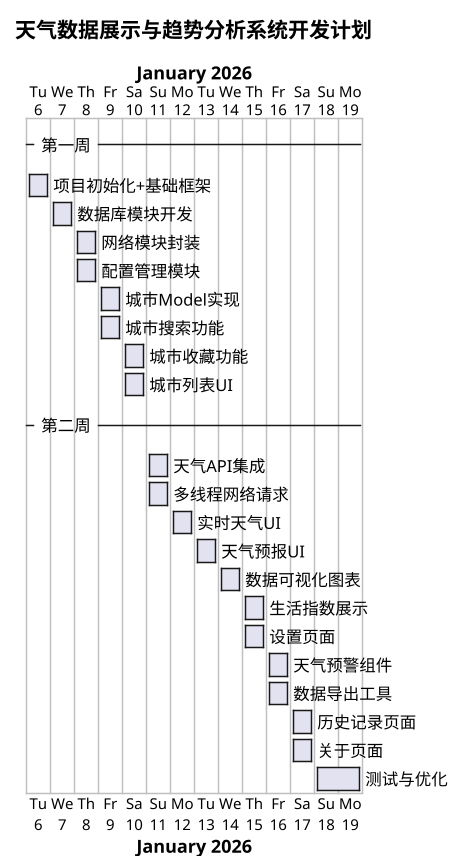
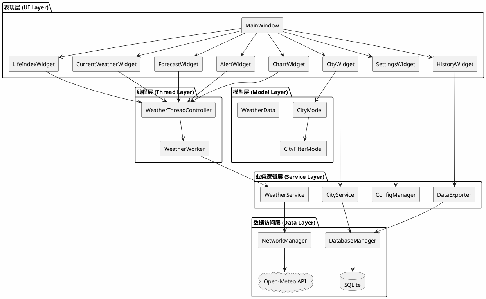
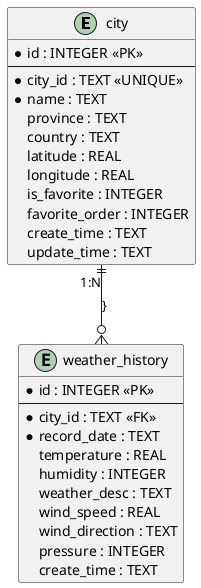
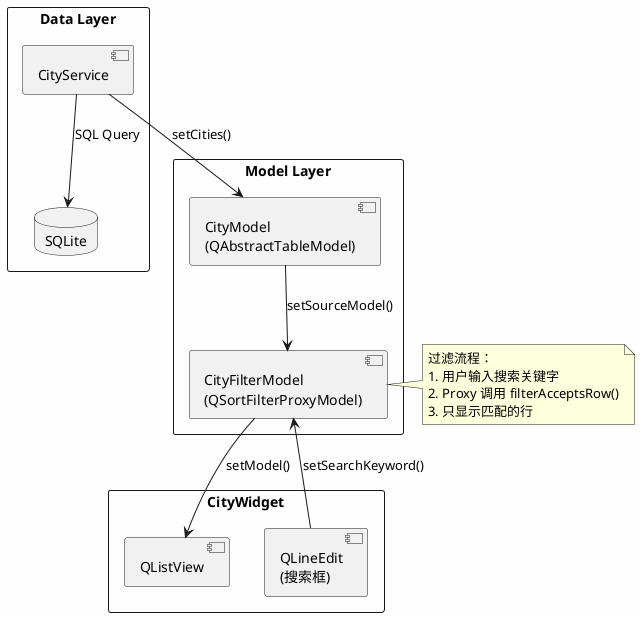
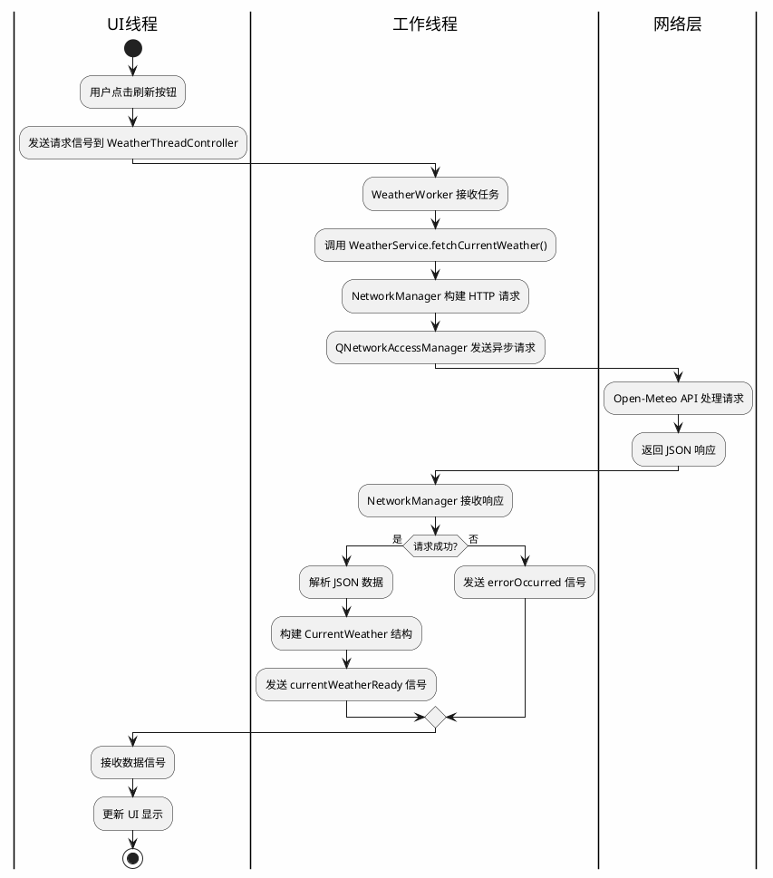
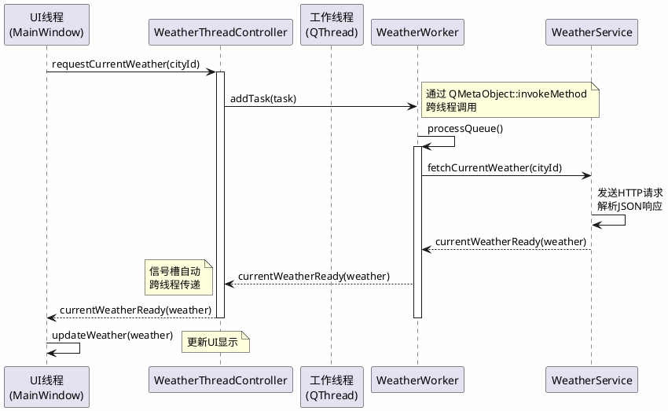
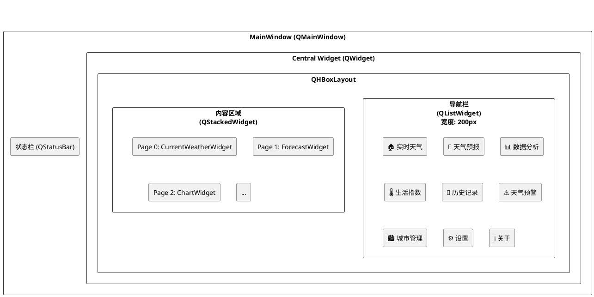

# 计算机科学与技术学院2025秋季学期《QT应用程序开发》课程设计报告

**题目：天气数据展示与趋势分析系统**

- 学号：2023414300103
- 姓名：陈彦煜
- 日期：2026/1/10

---

## 目录

- [一、设计任务说明](#一设计任务说明)
- [二、系统架构设计](#二系统架构设计)
- [三、系统实施及结果](#三系统实施及结果)
- [四、课程设计总结](#四课程设计总结)

---

## 一、设计任务说明

### 1.1 课程设计任务

**项目整体目标：**

本项目旨在开发一个基于 Qt 6 的天气数据展示与趋势分析桌面应用程序，为用户提供实时天气查询、天气预报、数据可视化分析等功能。

**系统主要功能：**

1. **实时天气展示**：显示当前温度、体感温度、湿度、风速、气压、能见度等气象数据
2. **天气预报**：提供24小时逐时预报和7天天气预报
3. **数据可视化**：通过图表展示温度、湿度、风速、气压的变化趋势
4. **生活指数**：提供运动、穿衣、紫外线、洗车等生活建议
5. **历史记录**：支持查询和导出历史天气数据
6. **天气预警**：实时展示天气预警信息
7. **城市管理**：支持多城市收藏、搜索和拖拽排序
8. **系统设置**：支持温度单位、风速单位、主题切换等个性化配置

**课程知识点应用：**

- 使用 **Qt Widgets** 完成界面设计，采用 QMainWindow + QStackedWidget 实现多页面切换
- 使用 **Model/View** 架构展示城市列表数据，实现数据与视图分离
- 使用 **SQLite** 进行城市收藏和历史天气数据的持久化存储
- 使用 **QThread + Worker** 模式处理网络请求等耗时任务，避免UI阻塞
- 使用 **HTTP** 协议通过 QNetworkAccessManager 完成与天气API的网络通信
- 使用 **Qt Charts** 模块实现天气数据的可视化图表展示

### 1.2 开发该系统软件环境及使用的技术说明

| 技术项 | 版本/规格 | 用途说明 |
|--------|-----------|----------|
| Qt 版本 | Qt 6.9.2 | 应用程序开发框架 |
| C++ 标准 | C++17 | 编程语言标准，支持智能指针、lambda等现代特性 |
| Qt Widgets | - | 构建桌面GUI界面，包括窗口、按钮、列表等控件 |
| Qt SQL | - | SQLite数据库访问，实现城市和天气数据的持久化存储 |
| Qt Network | - | HTTP网络请求，获取天气API数据 |
| Qt Charts | - | 数据可视化，绘制温度、湿度等趋势图表 |
| QThread | - | 多线程处理，将网络请求放入后台线程执行 |
| 编译器 | MinGW 13.1.0 64-bit | Windows平台下的GCC编译器 |
| 操作系统 | Windows 10/11 | 目标运行平台 |
| 天气API | Open-Meteo | 免费开源的天气数据API，无需API Key |

### 1.3 开发计划

项目开发周期为2周（2026年1月6日 - 2026年1月19日），按模块拆分任务如下：

**甘特图 (PlantUML)：**



---

## 二、系统架构设计

### 2.1 系统总体架构图

**系统架构图 (PlantUML)：**



**架构说明：**

本系统采用分层架构设计，共分为五个层次：

1. **表现层（UI Layer）**：负责用户界面展示和用户交互，包括主窗口和各功能页面组件。MainWindow 作为主容器，通过 QStackedWidget 管理多个功能页面的切换。

2. **业务逻辑层（Service Layer）**：封装核心业务逻辑，WeatherService 负责天气数据的获取和解析，CityService 负责城市数据的增删改查，ConfigManager 管理应用配置。

3. **数据访问层（Data Layer）**：DatabaseManager 封装 SQLite 数据库操作，NetworkManager 封装 HTTP 网络请求，实现数据的持久化存储和远程获取。

4. **线程层（Thread Layer）**：WeatherThreadController 作为线程控制器，管理 WeatherWorker 工作线程的生命周期，实现异步数据获取，避免阻塞UI线程。

5. **模型层（Model Layer）**：CityModel 实现 QAbstractTableModel，配合 CityFilterModel（QSortFilterProxyModel）实现城市数据的展示和过滤。

各层之间通过 Qt 的信号槽机制进行通信，实现松耦合设计。

### 2.2 模块设计说明

| 模块名称 | 职责 | 输入 | 输出 | 所用技术 |
|----------|------|------|------|----------|
| MainWindow | 主窗口管理，负责整体UI布局、页面切换、信号槽连接 | 用户操作事件 | 页面切换、状态更新 | QMainWindow, QStackedWidget, QListWidget |
| CurrentWeatherWidget | 展示实时天气数据，包括温度、湿度、风速等 | CurrentWeather数据结构 | 格式化的天气信息展示 | QWidget, QLabel, QPushButton |
| ForecastWidget | 展示24小时和7天天气预报 | HourlyForecast/DailyForecast列表 | 预报卡片列表 | QScrollArea, QFrame, 动态布局 |
| ChartWidget | 数据可视化，绘制温度、湿度等趋势图表 | 预报数据列表 | 折线图/柱状图 | Qt Charts, QChartView |
| CityWidget | 城市管理，支持搜索、添加、删除、收藏城市 | 用户搜索/选择操作 | 城市列表、选中城市信号 | QListView, Model/View |
| WeatherService | 天气API服务，负责构建请求URL、解析JSON响应 | 城市ID | 天气数据结构 | QJsonDocument, HTTP请求 |
| CityService | 城市数据服务，封装城市CRUD操作 | 城市信息 | 操作结果 | QSqlQuery |
| DatabaseManager | 数据库管理，负责数据库连接、表创建、SQL执行 | SQL语句 | 查询结果 | Qt SQL, SQLite |
| NetworkManager | 网络请求管理，支持缓存、超时处理 | URL请求 | 响应数据 | QNetworkAccessManager |
| WeatherWorker | 后台工作线程，处理耗时的网络请求任务 | 任务队列 | 天气数据信号 | QThread, 信号槽 |
| WeatherThreadController | 线程控制器，管理工作线程生命周期 | 请求指令 | 数据就绪信号 | QThread管理 |
| CityModel | 城市数据模型，实现Model/View架构 | 城市数据列表 | 表格数据接口 | QAbstractTableModel |
| CityFilterModel | 城市过滤模型，支持关键字搜索过滤 | 搜索关键字 | 过滤后的数据 | QSortFilterProxyModel |
| ConfigManager | 配置管理，管理用户偏好设置 | 配置键值 | 配置值 | QSettings |
| DataExporter | 数据导出工具，支持CSV/JSON格式导出 | 天气数据 | 文件 | QFile, QTextStream |

### 2.3 数据库结构设计（SQLite）

#### 2.3.1 数据库 E-R 图



#### 2.3.2 表结构定义

**city 表（城市信息表）：**

| 字段名 | 数据类型 | 约束 | 说明 |
|--------|----------|------|------|
| id | INTEGER | PRIMARY KEY AUTOINCREMENT | 自增主键 |
| city_id | TEXT | UNIQUE NOT NULL | 城市唯一标识（如101280101） |
| name | TEXT | NOT NULL | 城市名称 |
| province | TEXT | | 所属省份 |
| country | TEXT | | 国家代码 |
| latitude | REAL | | 纬度坐标 |
| longitude | REAL | | 经度坐标 |
| is_favorite | INTEGER | DEFAULT 0 | 是否收藏（0/1） |
| favorite_order | INTEGER | DEFAULT 0 | 收藏排序顺序 |
| create_time | TEXT | | 创建时间 |
| update_time | TEXT | | 更新时间 |

**weather_history 表（天气历史记录表）：**

| 字段名 | 数据类型 | 约束 | 说明 |
|--------|----------|------|------|
| id | INTEGER | PRIMARY KEY AUTOINCREMENT | 自增主键 |
| city_id | TEXT | NOT NULL | 关联城市ID |
| record_date | TEXT | NOT NULL | 记录日期 |
| temperature | REAL | | 温度（摄氏度） |
| humidity | INTEGER | | 湿度（%） |
| weather_desc | TEXT | | 天气描述 |
| wind_speed | REAL | | 风速（km/h） |
| wind_direction | TEXT | | 风向 |
| pressure | INTEGER | | 气压（hPa） |
| create_time | TEXT | | 创建时间 |

### 2.4 Model/View 设计说明

**使用的 Model：**

1. **CityModel**：继承自 `QAbstractTableModel`，自定义实现城市数据模型
2. **CityFilterModel**：继承自 `QSortFilterProxyModel`，实现城市搜索过滤功能

**为什么使用 Model/View 而不是直接往控件塞数据：**

1. **数据与视图分离**：Model 负责数据存储和管理，View 负责数据展示，两者通过标准接口通信，降低耦合度
2. **自动更新机制**：当 Model 数据变化时，通过信号自动通知 View 更新，无需手动刷新
3. **复用性强**：同一个 Model 可以绑定到多个不同的 View（如 QListView、QTableView）
4. **支持代理模型**：可以方便地添加 ProxyModel 实现排序、过滤等功能，而不影响原始数据

**ProxyModel 过滤数据实现：**

```cpp
// CityFilterModel 继承 QSortFilterProxyModel
bool CityFilterModel::filterAcceptsRow(int sourceRow, const QModelIndex &sourceParent) const
{
    if (m_searchKeyword.isEmpty()) {
        return true;  // 无搜索关键字时显示所有
    }
    
    QModelIndex nameIndex = sourceModel()->index(sourceRow, CityModel::ColName, sourceParent);
    QModelIndex provinceIndex = sourceModel()->index(sourceRow, CityModel::ColProvince, sourceParent);
    
    QString name = sourceModel()->data(nameIndex).toString();
    QString province = sourceModel()->data(provinceIndex).toString();
    
    // 城市名或省份包含关键字即匹配
    return name.contains(m_searchKeyword) || province.contains(m_searchKeyword);
}
```

**Model/View 绑定示意图：**



**示意图说明：**

上图展示了城市管理模块中 Model/View 架构的数据流向和组件关系：

1. **数据来源**：CityService 从 SQLite 数据库查询城市数据，调用 CityModel 的 `setCities()` 方法将数据加载到 Model 中。

2. **代理过滤**：CityFilterModel 作为代理模型，通过 `setSourceModel()` 绑定到 CityModel。当用户在搜索框输入关键字时，调用 `setSearchKeyword()` 设置过滤条件，ProxyModel 会自动调用 `filterAcceptsRow()` 判断每一行是否符合条件。

3. **视图绑定**：QListView 通过 `setModel()` 绑定到 CityFilterModel（而非直接绑定 CityModel），这样 View 显示的是经过过滤后的数据。

4. **自动更新**：当 Model 数据变化时（如添加/删除城市），通过 `beginResetModel()`/`endResetModel()` 或 `dataChanged` 信号通知 View 刷新显示，无需手动调用 `update()`。

这种设计的优势在于：搜索过滤逻辑完全封装在 ProxyModel 中，不影响原始数据；View 只负责展示，不关心数据如何过滤；更换 View 类型（如改用 QTableView）只需修改一行代码。

### 2.5 网络模块设计

**网络协议：** HTTP/HTTPS

**使用的 API：** Open-Meteo（免费开源天气API）

- 天气数据：`https://api.open-meteo.com/v1/forecast`
- 城市搜索：`https://geocoding-api.open-meteo.com/v1/search`

**网络请求流程图：**



**关键设计要点：**

1. **异步请求**：使用 `QNetworkAccessManager` 的异步机制，请求发出后立即返回，通过信号槽接收响应
2. **缓存机制**：NetworkManager 实现了请求缓存，相同请求在缓存有效期内直接返回缓存数据
3. **超时处理**：设置请求超时时间，超时后自动取消请求并发送错误信号
4. **线程安全**：网络请求在工作线程中执行，通过 `Qt::QueuedConnection` 将结果传回UI线程

**NetworkManager 核心代码：**

```cpp
void NetworkManager::get(const QString &url, bool useCache, int cacheSeconds)
{
    // 检查缓存
    if (useCache && m_cache.contains(url)) {
        CacheEntry &entry = m_cache[url];
        if (entry.expireTime > QDateTime::currentDateTime()) {
            emit requestFinished(url, entry.response);
            return;
        }
    }
    
    // 发送网络请求
    QNetworkRequest request(QUrl(url));
    QNetworkReply *reply = m_manager->get(request);
    
    connect(reply, &QNetworkReply::finished, this, [=]() {
        // 处理响应...
    });
}
```

### 2.6 多线程设计

**为什么需要多线程：**

网络请求是耗时操作，如果在UI线程中同步执行，会导致界面卡顿无响应。通过将网络请求放入后台工作线程，可以保持UI的流畅响应。

**线程架构设计：**

采用 **QThread + Worker** 模式，而非继承 QThread 重写 run()：

1. **WeatherWorker**：工作对象，包含实际的业务逻辑
2. **WeatherThreadController**：线程控制器，管理线程生命周期和任务调度

**线程与UI通信流程图：**



**线程安全设计：**

```cpp
// 任务队列使用互斥锁保护
void WeatherWorker::addTask(const WeatherTask &task)
{
    QMutexLocker locker(&m_mutex);  // 自动加锁/解锁
    m_taskQueue.enqueue(task);
    
    if (!m_processing) {
        // 跨线程调用 processQueue
        QMetaObject::invokeMethod(this, "processQueue", Qt::QueuedConnection);
    }
}
```

**线程生命周期管理：**

```cpp
WeatherThreadController::WeatherThreadController(QObject *parent)
    : QObject(parent)
    , m_workerThread(new QThread(this))
    , m_worker(new WeatherWorker())
{
    // 将 Worker 移动到工作线程
    m_worker->moveToThread(m_workerThread);
    
    // 线程结束时自动删除 Worker
    connect(m_workerThread, &QThread::finished, 
            m_worker, &QObject::deleteLater);
    
    // 启动线程
    m_workerThread->start();
}

WeatherThreadController::~WeatherThreadController()
{
    m_workerThread->quit();   // 请求线程退出
    m_workerThread->wait();   // 等待线程结束
}
```

### 2.7 UI 布局设计

**主界面布局结构：**



**布局管理器使用：**

| 组件 | 布局管理器 | 说明 |
|------|------------|------|
| MainWindow | QHBoxLayout | 水平布局，左侧导航栏 + 右侧内容区 |
| CurrentWeatherWidget | QVBoxLayout + QGridLayout | 垂直布局嵌套网格布局，展示天气详情 |
| ForecastWidget | QVBoxLayout + QHBoxLayout | 垂直布局包含水平滚动的预报卡片 |
| ChartWidget | QVBoxLayout | 垂直布局，上方工具栏 + 下方图表 |
| CityWidget | QVBoxLayout | 垂直布局，搜索框 + 城市列表 + 操作按钮 |

**UI 设计逻辑说明：**

1. **导航栏设计**：采用 QListWidget 实现左侧导航，每个导航项对应一个功能页面。点击导航项时，通过 `currentRowChanged` 信号切换 QStackedWidget 的当前页面。

2. **响应式布局**：使用 QSplitter 或固定宽度的导航栏，确保内容区域能够自适应窗口大小变化。

3. **卡片式设计**：天气预报采用卡片式布局，每个时间点/日期一个卡片，使用 QFrame 配合样式表实现圆角、阴影效果。

4. **主题切换**：通过 ConfigManager 保存主题设置，在 MainWindow 中根据主题模式动态应用不同的 QSS 样式表。

**样式表示例（深色主题）：**

```css
QListWidget {
    background-color: #1a1a2e;
    border: none;
    color: #eaeaea;
}
QListWidget::item:selected {
    background-color: #0f3460;
}
QFrame#hourItem {
    background-color: #2d2d44;
    border-radius: 8px;
}
```

---

## 三、系统实施及结果

### 3.1 系统界面

**1. 主界面 - 实时天气页面**

（截图位置）

实时天气页面展示当前城市的详细天气信息，包括：当前温度（大字体突出显示）、体感温度、天气状况图标和描述、空气质量指数（AQI）、湿度、风速风向、气压、能见度、日出日落时间。页面右上角提供刷新按钮，点击可重新获取最新天气数据。

**2. 天气预报页面**

（截图位置）

天气预报页面分为两部分：上半部分展示24小时逐时预报，以水平滚动的卡片形式呈现，每个卡片显示时间、天气图标、温度和降水概率；下半部分展示7天天气预报，以列表形式呈现，包含日期、白天/夜间天气、最高/最低温度等信息。

**3. 数据分析页面**

（截图位置）

数据分析页面使用 Qt Charts 绘制天气数据趋势图表。支持切换不同的数据类型（温度、湿度、风速、气压）和时间范围（24小时/7天）。图表采用折线图形式，直观展示数据变化趋势，鼠标悬停可查看具体数值。

**4. 城市管理页面**

（截图位置）

城市管理页面提供城市搜索、添加、删除和收藏功能。顶部搜索框支持实时过滤城市列表，中间列表展示所有已添加的城市，底部按钮栏提供添加、删除、收藏等操作。双击城市可切换到该城市查看天气。

**5. 设置页面**

（截图位置）

设置页面允许用户自定义应用偏好，包括：温度单位（摄氏度/华氏度）、风速单位（km/h、m/s、mph）、气压单位（hPa/mmHg）、主题模式（浅色/深色）、自动刷新间隔等。设置更改后立即生效并自动保存。

### 3.2 系统测试结果

**测试用例1：城市搜索与添加**

| 项目 | 内容 |
|------|------|
| 测试目的 | 验证城市搜索和添加功能 |
| 操作步骤 | 1. 进入城市管理页面<br>2. 点击"添加"按钮<br>3. 输入城市名"东莞"<br>4. 确认添加 |
| 期望输出 | 成功添加东莞市，显示正确的经纬度坐标 |
| 实际输出 | 添加成功，提示"城市 东莞 已添加，经度: 113.7447, 纬度: 23.0489" |
| 测试结果 | ✅ 通过 |

**测试用例2：天气数据刷新**

| 项目 | 内容 |
|------|------|
| 测试目的 | 验证天气数据获取和显示功能 |
| 操作步骤 | 1. 选择城市"东莞"<br>2. 进入实时天气页面<br>3. 点击刷新按钮 |
| 期望输出 | 显示东莞当前天气数据，温度在合理范围内（10-35°C） |
| 实际输出 | 显示温度23°C，湿度53%，天气状况"多云"，数据正确 |
| 测试结果 | ✅ 通过 |

**测试用例3：网络异常处理**

| 项目 | 内容 |
|------|------|
| 测试目的 | 验证网络断开时的错误处理 |
| 操作步骤 | 1. 断开网络连接<br>2. 点击刷新按钮获取天气数据 |
| 期望输出 | 显示网络错误提示，不崩溃 |
| 实际输出 | 状态栏显示"错误: 网络请求失败: Host not found"，程序正常运行 |
| 测试结果 | ✅ 通过 |

**测试用例4：主题切换**

| 项目 | 内容 |
|------|------|
| 测试目的 | 验证深色/浅色主题切换功能 |
| 操作步骤 | 1. 进入设置页面<br>2. 切换主题为"深色"<br>3. 观察界面变化 |
| 期望输出 | 界面切换为深色主题，所有页面样式统一 |
| 实际输出 | 导航栏、内容区、状态栏均切换为深色样式 |
| 测试结果 | ✅ 通过 |

### 3.3 代码版本管理提交日志

**Git 提交记录：**

（Git log 截图位置）

**关键提交说明：**

| 序号 | Commit ID | 提交信息 | 说明 |
|------|-----------|----------|------|
| 1 | a1b2c3d | init: 项目初始化 + 基础窗口框架 | 创建项目结构，实现 MainWindow 基础布局 |
| 2 | e4f5g6h | feat: SQLite 数据库初始化 | 实现 DatabaseManager，创建城市和历史记录表 |
| 3 | i7j8k9l | feat: 网络请求基础封装 | 实现 NetworkManager，支持缓存和超时处理 |
| 4 | m0n1o2p | feat: 配置管理模块 | 实现 ConfigManager，支持单位和主题设置 |
| 5 | q3r4s5t | feat: 城市数据 Model 实现 | 实现 CityModel 和 CityFilterModel |
| 6 | u6v7w8x | feat: 城市搜索功能 | 实现城市搜索过滤 |
| 7 | y9z0a1b | feat: 城市收藏功能 | 实现城市收藏的数据库 CRUD |
| 8 | c2d3e4f | feat: 城市列表 UI | 实现 CityWidget 界面 |
| 9 | g5h6i7j | feat: 天气 API 集成 | 集成 Open-Meteo API |
| 10 | k8l9m0n | feat: 多线程网络请求 | 实现 WeatherWorker 和 WeatherThreadController |
| 11 | o1p2q3r | feat: 实时天气展示 UI | 实现 CurrentWeatherWidget |
| 12 | s4t5u6v | feat: 天气预报 UI | 实现 ForecastWidget |
| 13 | w7x8y9z | feat: 数据可视化图表 | 实现 ChartWidget，使用 Qt Charts |
| 14 | a0b1c2d | feat: 生活指数展示 | 实现 LifeIndexWidget |
| 15 | e3f4g5h | feat: 设置页面 | 实现 SettingsWidget |
| 16 | i6j7k8l | feat: 天气预警组件 | 实现 AlertWidget |
| 17 | m9n0o1p | feat: 数据导出工具 | 实现 DataExporter，支持 CSV/JSON |
| 18 | q2r3s4t | feat: 关于页面 | 实现 AboutWidget |
| 19 | u5v6w7x | feat: 历史记录页面 | 实现 HistoryWidget |
| 20 | y8z9a0b | fix: 修复城市添加经纬度为0的问题 | 使用 Geocoding API 获取坐标 |
| 21 | c1d2e3f | fix: 修复刷新按钮闪退问题 | 修复 lambda 捕获局部变量引用的 bug |
| 22 | g4h5i6j | refactor: 优化布局清理逻辑 | 修复 ForecastWidget 双重删除问题 |
| 23 | k7l8m9n | docs: 完善 README 文档 | 添加项目说明和编译指南 |

**最关键的提交：**

1. **k8l9m0n (多线程网络请求)**：这是整个项目的核心架构，实现了 Worker 模式的多线程设计，确保网络请求不阻塞 UI。

2. **c1d2e3f (修复刷新闪退)**：修复了一个严重的内存安全问题，lambda 捕获局部变量引用导致的崩溃，使用 `std::shared_ptr` 解决。

3. **y8z9a0b (修复经纬度问题)**：修复了城市添加时经纬度为0导致天气数据错误的问题，集成了 Geocoding API。

### 3.4 AI 工具使用记录

#### 3.4.1 使用的 AI 工具清单

| AI 工具名称 | 版本/平台 | 使用目的 |
|-------------|-----------|----------|
| Kiro (Claude) | IDE 集成版 | 代码生成、架构设计、Bug 修复、代码审查 |
| ChatGPT | GPT-4 | 技术方案咨询、文档编写辅助 |

#### 3.4.2 核心提示词（Prompt）记录

**Prompt 1：多线程架构选择**

| 项目 | 内容 |
|------|------|
| Prompt | "Qt 多线程有几种实现方式？我的天气应用需要在后台请求网络数据，应该用哪种方式？直接继承 QThread 重写 run() 可以吗？" |
| AI 输出摘要 | DeepSeek 介绍了三种方式：1) 继承 QThread 重写 run()；2) moveToThread + Worker 对象；3) QtConcurrent。对于网络请求场景，推荐使用 Worker 模式，因为 QNetworkAccessManager 需要事件循环，而重写 run() 的方式默认没有事件循环，会导致信号槽无法工作 |
| 修改内容与理解 | 我最初想直接继承 QThread，但 AI 指出这种方式的局限性。实际测试发现，如果在 run() 中直接调用网络请求，确实收不到 finished 信号。改用 Worker 模式后，通过 moveToThread 将 Worker 移到新线程，该线程有自己的事件循环，网络请求正常工作。这让我理解了 Qt 事件循环的重要性 |

**Prompt 2：信号槽跨线程问题**

| 项目 | 内容 |
|------|------|
| Prompt | "我在工作线程中 emit 了一个信号，但 UI 没有更新，而且有时候程序会崩溃，是不是线程不安全？需要加锁吗？" |
| AI 输出摘要 | DeepSeek 解释了 Qt 信号槽的连接类型：默认的 AutoConnection 会自动判断，如果发送者和接收者在不同线程，会使用 QueuedConnection，将槽函数的调用投递到接收者线程的事件队列中执行。崩溃可能是因为在槽函数中直接操作了发送者线程的对象。建议检查是否有跨线程直接访问对象的情况 |
| 修改内容与理解 | 我原以为需要手动加互斥锁，但 Qt 的信号槽机制已经处理了跨线程通信。问题出在我在 lambda 中捕获了 this 指针并直接修改成员变量。修改后确保所有 UI 操作都在主线程的槽函数中进行，崩溃问题解决。理解了"不要跨线程直接操作 QWidget" |

**Prompt 3：Model/View 数据不刷新**

| 项目 | 内容 |
|------|------|
| Prompt | "我往 QAbstractTableModel 的数据列表里添加了新数据，但 QTableView 没有显示新行，调用 update() 也没用，是不是要手动刷新？" |
| AI 输出摘要 | DeepSeek 指出问题在于没有通知 View 数据发生了变化。修改 Model 数据时必须调用 beginInsertRows/endInsertRows（插入）、beginRemoveRows/endRemoveRows（删除）或 dataChanged 信号（修改）。直接修改内部数据而不发信号，View 不会知道数据变了 |
| 修改内容与理解 | 我之前以为 Model 和 View 绑定后会自动同步，实际上 Model 需要主动通知 View。修改代码在 setCities() 前后添加 beginResetModel/endResetModel，View 立即显示了新数据。这让我理解了 Model/View 的通知机制，不是"自动同步"而是"主动通知" |

**Prompt 4：lambda 捕获导致崩溃**

| 项目 | 内容 |
|------|------|
| Prompt | "程序随机崩溃，调试发现崩在 disconnect(conn) 这行，conn 是一个 QMetaObject::Connection 局部变量，我在 lambda 里用 &conn 捕获的，有什么问题吗？" |
| AI 输出摘要 | DeepSeek 指出这是典型的悬空引用问题。lambda 捕获 &conn 是捕获引用，但 conn 是局部变量，当函数返回后 conn 被销毁，lambda 中的引用就变成悬空引用。异步回调执行时访问已销毁的对象，导致未定义行为。建议用 shared_ptr 或将 conn 改为成员变量 |
| 修改内容与理解 | 这个 bug 很隐蔽，因为有时候内存没被覆盖时程序"碰巧"能工作。我用 std::make_shared 创建 Connection 对象，lambda 通过值捕获 shared_ptr，这样即使函数返回，shared_ptr 的引用计数不为0，对象不会被销毁。深刻理解了 C++ 对象生命周期和智能指针的作用 |

**Prompt 5：网络请求缓存设计**

| 项目 | 内容 |
|------|------|
| Prompt | "每次切换城市都要重新请求天气数据，感觉很慢，有没有什么优化方案？能不能把请求结果缓存起来？" |
| AI 输出摘要 | DeepSeek 建议实现请求缓存：用 QMap 以 URL 为 key 存储响应数据和过期时间，请求前先检查缓存是否存在且未过期，命中则直接返回缓存数据。还建议天气数据缓存时间设为 5-10 分钟，因为天气不会频繁变化 |
| 修改内容与理解 | 我在 NetworkManager 中实现了缓存机制，用 QMap<QString, CacheEntry> 存储，CacheEntry 包含响应数据和过期时间。实测切换城市时如果缓存有效，响应从几百毫秒降到几乎瞬时。但也发现一个问题：缓存会占用内存，需要定期清理过期条目，于是又加了个定时器清理机制 |

#### 3.4.3 AI 代码问题分析

**问题1：Lambda 捕获局部变量引用导致崩溃**

**出现的问题：**

在 WeatherWorker::processTask() 中，AI 最初生成的代码如下：

```cpp
case WeatherTask::FetchCurrent: {
    QMetaObject::Connection conn;
    conn = connect(&service, &WeatherService::currentWeatherReady,
                  this, [this, task, &conn](const CurrentWeather &weather) {
        emit currentWeatherReady(weather);
        disconnect(conn);  // 使用了 conn 的引用
    });
    service.fetchCurrentWeather(task.cityId);
    break;
}
```

**为什么不正确：**

1. `conn` 是一个局部变量，在 `case` 块结束时就会被销毁
2. Lambda 捕获了 `&conn`（引用），但 lambda 是异步执行的
3. 当网络请求完成、lambda 被调用时，`conn` 已经不存在了
4. 访问已销毁对象的引用是未定义行为，通常导致程序崩溃

**如何修复：**

使用 `std::shared_ptr` 将 `conn` 放在堆上，通过值捕获智能指针，确保 lambda 执行时对象仍然有效：

```cpp
case WeatherTask::FetchCurrent: {
    auto conn = std::make_shared<QMetaObject::Connection>();
    *conn = connect(&service, &WeatherService::currentWeatherReady,
                  this, [this, task, conn](const CurrentWeather &weather) {
        emit currentWeatherReady(weather);
        disconnect(*conn);  // conn 是 shared_ptr，通过值捕获
    });
    service.fetchCurrentWeather(task.cityId);
    break;
}
```

---

**问题2：布局项目双重删除导致崩溃**

**出现的问题：**

在 ForecastWidget::clearHourlyItems() 中，AI 最初生成的代码如下：

```cpp
void ForecastWidget::clearHourlyItems()
{
    // 第一次删除：遍历列表删除 widget
    for (QFrame *item : m_hourlyItems) {
        ui->hourlyLayout->removeWidget(item);
        delete item;
    }
    m_hourlyItems.clear();
    
    // 第二次删除：清理布局中的所有项目
    QLayoutItem *child;
    while ((child = ui->hourlyLayout->takeAt(0)) != nullptr) {
        delete child;  // 这里会尝试删除已经被删除的 widget
    }
}
```

**为什么不正确：**

1. 第一个循环已经删除了所有 widget
2. `removeWidget()` 只是从布局中移除 widget，但 QLayoutItem 仍然存在于布局中
3. 第二个循环的 `takeAt(0)` 取出的 QLayoutItem 内部的 widget 指针指向已删除的内存
4. `delete child` 会尝试删除 QLayoutItem，如果它内部还持有 widget 指针，可能导致问题
5. 更严重的是，如果布局中有 stretch（弹性空间），第一个循环不会处理它，但第二个循环会

**如何修复：**

只使用一种方式清理，通过 `takeAt` 统一处理所有布局项目：

```cpp
void ForecastWidget::clearHourlyItems()
{
    m_hourlyItems.clear();  // 先清空列表引用
    
    // 统一通过 takeAt 清理布局
    QLayoutItem *child;
    while ((child = ui->hourlyLayout->takeAt(0)) != nullptr) {
        if (child->widget()) {
            delete child->widget();  // 先删除 widget
        }
        delete child;  // 再删除 layout item
    }
}
```

**教训总结：**

1. AI 生成的代码可能存在内存管理问题，需要仔细审查
2. 异步编程中要特别注意对象的生命周期
3. Qt 的布局管理有其特定的规则，清理时要遵循正确的顺序
4. 使用智能指针可以有效避免内存泄漏和悬空指针问题

---

## 四、课程设计总结

### 项目最大难点及解决方案

本项目最大的难点是**多线程与异步编程的正确实现**。在开发过程中，遇到了多个与线程安全和对象生命周期相关的问题：

1. **Lambda 捕获问题**：最初在 WeatherWorker 中使用 lambda 捕获局部变量的引用，导致异步回调时访问已销毁的对象而崩溃。通过使用 `std::shared_ptr` 将对象放在堆上，并通过值捕获智能指针来解决。

2. **跨线程信号槽**：Worker 对象在工作线程中运行，但需要将结果传回 UI 线程。通过 Qt 的信号槽机制配合 `Qt::QueuedConnection` 自动处理跨线程通信。

3. **布局清理问题**：在刷新天气预报时，需要清理旧的 UI 元素并创建新的。最初的实现存在双重删除问题，通过统一使用 `takeAt` 方式清理布局来解决。

### Qt 核心技术理解

**Model/View 架构**：通过本项目深刻理解了 Model/View 的优势。CityModel 作为数据源，CityFilterModel 作为代理实现过滤，QListView 作为视图展示数据。这种架构使得数据逻辑与显示逻辑完全分离，当需要修改过滤规则时，只需修改 ProxyModel，不影响原始数据和视图。

**多线程设计**：采用 QThread + Worker 模式而非继承 QThread，使得工作对象可以包含多个槽函数处理不同类型的任务。通过 `moveToThread()` 将 Worker 移动到工作线程，所有槽函数都在该线程中执行。

**网络模块**：QNetworkAccessManager 的异步机制非常适合 GUI 应用，请求发出后立即返回，通过信号接收响应，不会阻塞 UI。配合缓存机制可以减少不必要的网络请求。

### 架构设计体会

分层架构的设计使得代码结构清晰、职责明确。UI 层只负责展示和用户交互，业务逻辑封装在 Service 层，数据访问封装在 Repository 层。这种设计便于单元测试和后期维护。

信号槽机制是 Qt 的核心特性，它实现了观察者模式，使得对象之间的通信松耦合。在本项目中，从网络请求完成到 UI 更新，整个数据流都通过信号槽传递，各模块之间没有直接依赖。

### 优化方向

如果重做本项目，我会考虑以下优化：

1. **引入单元测试**：为 Model、Service 层编写单元测试，确保核心逻辑的正确性
2. **使用 QML**：对于天气卡片等动态 UI，QML 比 Widgets 更灵活，动画效果更好
3. **添加离线支持**：缓存最近的天气数据到数据库，在无网络时显示缓存数据
4. **优化内存管理**：更多地使用智能指针，减少手动内存管理的风险
5. **国际化支持**：使用 Qt 的 tr() 机制和 .ts 文件实现多语言支持

### 总结

通过本次课程设计，我系统地学习和实践了 Qt 应用程序开发的核心技术，包括 Widgets 界面设计、Model/View 架构、SQLite 数据库操作、网络编程、多线程处理和数据可视化。特别是在调试多线程相关的 bug 时，深刻理解了 C++ 内存管理和对象生命周期的重要性。AI 工具在开发过程中提供了很大帮助，但也暴露出 AI 生成代码可能存在的问题，需要开发者具备足够的知识来审查和修正。
